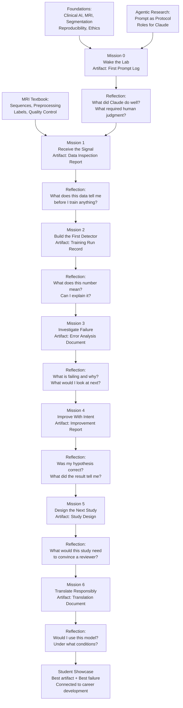

# Lab Alignment Summary — Quick Reference

One-page reference for instructors. Use this to check that the right prerequisites, prompt principles, and clinical concepts are in scope for each mission, and to see how the missions connect.

---

## Mission Quick Reference Table

| Mission | Title | Prerequisite Reading | Prompt Principle | Artifact | Clinical Concept |
|---------|-------|---------------------|-----------------|----------|-----------------|
| **0** | Wake the Lab | What Is Agentic Coding; Claude Code Workflow | Specific context-setting; scope constraint | First prompt log; confirmed environment | AI as tool requiring human judgment |
| **1** | Receive the Signal | T1, T2 and FLAIR; Labels and Masks; Data Inspection | Planner for exploration; output format explicit | Data inspection report + class distribution summary | Patient-level split; class imbalance |
| **2** | Build the First Detector | Baseline Modeling; Metrics; Roles for Claude | Planner before code; approval gate | Training run record: config + curves + Dice by sub-region | Baseline reference; what Dice does and does not capture |
| **3** | Investigate Failure | Error Analysis; Roles for Claude (Critic); Error Analysis Prompts | Critic pattern; evidence-to-hypothesis | Error analysis doc: failure mode + cause hypothesis | Clinical significance of failure modes; reproducibility |
| **4** | Improve With Intent | Model Improvement; Reviewer Prompts | One-change constraint; hypothesis before experiment | Improvement report: hypothesis + result + interpretation | Exploratory vs. confirmatory research |
| **5** | Design the Next Study | Study Design; Ethics, Privacy and Safety | Study design structuring; stakeholder framing | Prospective study design: question + endpoint + population + sample size | Prospective validation; multi-site requirements |
| **6** | Translate Responsibly | Clinical Translation; Ethics; From Lab to Research | Checklist completion; honest gap documentation | Translation document: readiness assessment + gaps + next steps | Regulatory pathway; research-to-clinical gap |

---

## Mission Flow and Artifact Connections

---

## Day-by-Day Pacing Alignment

| Time | Activity | Mission | Key Instructor Action |
|------|----------|---------|----------------------|
| Day 1, 09:00–09:20 | Course opening | — | Frame: prompt as protocol; AI as tool not magic |
| Day 1, 09:20–09:30 | Live Demo 1 | 0 | Show bad vs. good prompt contrast |
| Day 1, 09:30–10:00 | Lab: Mission 0 | 0 | Circulate; watch for vague prompts |
| Day 1, 10:00–10:20 | Debrief Mission 0 | 0 | Ask: what surprised you? Point to CLAUDE.md |
| Day 1, 10:20–11:00 | MRI lecture (cheat sheet) | 1 | Ask what students know; cover sequences + labels + spacing |
| Day 1, 11:00–12:00 | Lab: Mission 1 | 1 | Pair technical + clinical students |
| Day 1, 12:00–13:00 | Lunch | — | — |
| Day 1, 13:00–13:05 | Live Demo 2 | 2 | Planner pattern before training code |
| Day 1, 13:05–15:00 | Lab: Mission 2 | 2 | Use model training wait time for discussion |
| Day 1, 15:00–15:30 | Debrief Mission 2 | 2 | Open with: what surprised you? Introduce baseline reference |
| Day 1, 15:30–17:00 | Structured reading / catch-up | 1–2 | Students who finished Mission 2 read Mission 3 prerequisites |
| Day 2, 09:00–09:30 | Error analysis lecture (interactive) | 3 | Show failure, ask students to hypothesise before revealing |
| Day 2, 09:30–09:35 | Live Demo 3 | 3 | Critic pattern with example metrics |
| Day 2, 09:35–11:00 | Lab: Mission 3 | 3 | Hold students to pattern; failure = observation → cause |
| Day 2, 11:00–11:30 | Debrief Mission 3 | 3 | Ask each group: one-sentence failure mode; reproducibility discussion |
| Day 2, 11:30–12:00 | Lab: Mission 4 begin | 4 | Hold students to one change only |
| Day 2, 12:00–13:00 | Lunch | — | — |
| Day 2, 13:00–14:00 | Lab: Mission 4 complete | 4 | Debrief: hypothesis correct? Negative result = result |
| Day 2, 14:00–15:30 | Lab: Missions 5 and 6 (pairs) | 5, 6 | Encourage clinical + computational pairs |
| Day 2, 15:30–16:00 | Showcase preparation | — | Dashboard walkthrough or poster or slides |
| Day 2, 16:00–17:00 | Showcase | 6 | Best artifact + best failure; Dice is not a judging criterion |

---

## Prompt Principle Progression

The prompt principles introduced in each mission build on each other. By Mission 6, students should be using all of them.

| Prompt Principle | Introduced | Description |
|-----------------|-----------|-------------|
| Context-setting | Mission 0 | Open every Claude session with: what project, what directory, what exists |
| Scope constraint | Mission 0 | "Only modify X. Do not change any other file." |
| Output format specification | Mission 1 | "Return your answer as a numbered list / as a table / as a Python dict" |
| Planner pattern | Mission 2 | Describe the plan before writing any code; wait for approval |
| Approval gate | Mission 2 | "Do not proceed until I say 'approved'" |
| Critic pattern | Mission 3 | "Act as a critical reviewer. Identify weaknesses, not strengths." |
| Evidence-to-hypothesis framing | Mission 3 | "Given this evidence, what are the most likely causes? For each, what would confirm or disconfirm it?" |
| One-change constraint | Mission 4 | "Make only this change. Do not fix anything else you notice." |
| Hypothesis-first prompt | Mission 4 | State prediction before asking Claude to run or implement |
| Stakeholder framing | Mission 5 | "From the perspective of [radiologist / ethics board / funder], what concerns would they raise?" |
| Checklist completion | Mission 6 | "Complete this checklist item by item. For each item, provide a specific evidence-based answer, not a general description." |
