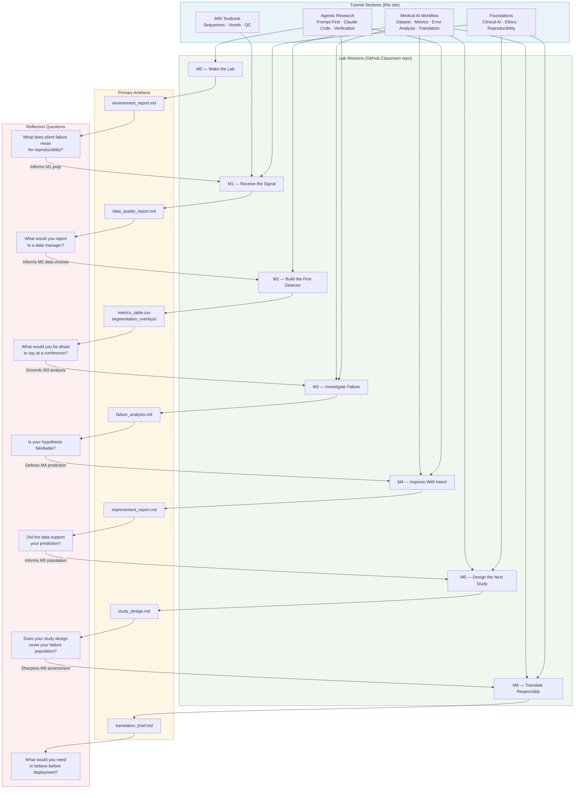

# Lab Alignment Table

This page is the master map of the course learning system. It shows, in a single view, how every tutorial section connects to a lab mission, what prompt principle governs that mission, what artefact the mission produces, what clinical question the artefact is meant to answer, and what the student is asked to reflect on before moving to the next step. Instructors can use this table to plan sessions and to diagnose where a student who is struggling has lost the thread. Students can use it to orient themselves at the start of each mission and to understand where a given tutorial chapter sits in the overall arc.

The table is not a substitute for reading the tutorial chapters or the mission briefs. It is a map: it shows you the territory but does not walk you through it.

---

## Table 1: Master Alignment Map

| Tutorial Section | Core Concept | Lab Mission | Prompt Principle | Primary Artefact | Reflection Question | Optional Extension |
|-----------------|--------------|-------------|-----------------|-----------------|--------------------|--------------------|
| [What Is Agentic Coding](../agentic_research/what_is_agentic_coding.md) · [Claude Code Workflow](../agentic_research/claude_code_workflow.md) | The AI agent as a directed research instrument, not an autonomous executor; environment reproducibility as a precondition for science | **M0 — Wake the Lab** | *Verification prompt*: ask the agent to confirm a specific expected state and report any discrepancy, rather than simply execute a task | `environment_report.md` — a structured confirmation that Python, all dependencies, Claude Code, and the data directory are present and responsive | What would it mean for a computational research environment to "fail silently" — and why is M0 a scientific act, not just a technical one? | Run M0 on a second machine or container and compare the environment reports. Document any differences. |
| [MRI Basics](../mri/what_is_mri.md) · [T1, T2, and FLAIR](../mri/t1_t2_flair.md) · [Data Inspection](../medical_ai_workflow/data_inspection.md) · [Quality Control](../mri/quality_control.md) | MRI sequence contrast mechanisms; voxel geometry and orientation; intensity statistics; data quality indicators in clinical imaging | **M1 — Receive the Signal** | *Inspection prompt*: instruct the agent to produce a structured report with specific named sections (sequence summary, voxel spacing, intensity statistics, label coverage, anomalies), so the output is verifiable against a known schema | `data_quality_report.md` — a one-page structured summary of the three MRI cases, including flagged quality issues | Which of your findings in the data quality report would you report to a data manager before beginning any modelling? Why? | Compute and plot the intensity histogram for each sequence across all three cases. Identify whether the distributions are compatible with direct cross-case comparison or whether intensity normalisation is required. |
| [Segmentation Basics](../foundations/segmentation_basics.md) · [Baseline Modeling](../medical_ai_workflow/baseline_modeling.md) · [Metrics](../medical_ai_workflow/metrics_dice_sensitivity_specificity.md) | What segmentation means biologically and computationally; the difference between threshold-based and learned segmentation; how Dice, sensitivity, and specificity are computed and what each measures clinically | **M2 — Build the First Detector** | *Implementation prompt*: specify the model class, the input data contract (which sequences, which cases), the output format (binary mask in NIfTI format), and the evaluation metrics to compute — do not specify implementation details inside the prompt | `metrics_table.csv` + `segmentation_overlays/` — per-case Dice, sensitivity, and specificity values plus axial/coronal/sagittal overlays for each case | If you had to report your Mission 2 results at a clinical conference, what would you say — and what would you be afraid to say? | Compute 95th-percentile Hausdorff distance in addition to Dice and sensitivity. Look up what this metric measures and explain in one sentence why it may be more clinically meaningful than Dice for surgical planning. |
| [Error Analysis](../medical_ai_workflow/error_analysis.md) · [Brain Tumour Imaging](../foundations/brain_tumour_imaging.md) | Spatial failure classification (false positive, false negative, boundary error); anatomical context of misclassification; the role of biological knowledge in interpreting model behaviour | **M3 — Investigate Failure** | *Diagnosis prompt*: frame the agent's task as a structured investigation with predefined categories — present the worst-case metrics, instruct the agent to classify failure type and identify anatomical region of failure, and ask for a hypothesis in the form of a causal statement | `failure_analysis.md` — failure type classification, anatomical localisation of error, biological hypothesis, and a proposed testable intervention | Is your failure hypothesis falsifiable? What experiment would definitively refute it? | Examine the second-worst case from M2. Does it share the same failure mode as the worst case, or is it qualitatively different? What does this imply for whether your hypothesis from M3 is general or case-specific? |
| [Model Improvement](../medical_ai_workflow/model_improvement.md) · [Prompt Best Practices](../agentic_research/prompt_best_practices.md) | The experimental cycle of predict-intervene-measure; encoding a biological hypothesis as a prompt modification; the distinction between metric improvement and scientific insight | **M4 — Improve With Intent** | *Prediction prompt*: before any code runs, write a prompt asking the agent to record your prediction (the specific change you are making, the metric you expect to change, the direction and approximate magnitude, and the mechanistic reason). This prediction becomes part of the artefact. | `improvement_report.md` — the written prediction, the modified pipeline run, a comparison metrics table (M2 vs. M4), and a paragraph assessing whether the data supported the prediction | Did the intervention work in the way you predicted? If not, does the discrepancy give you a better hypothesis than the one you started with? | Run the pipeline with two contrasting interventions (e.g., one that adds a preprocessing step and one that changes the decision threshold) and compare their effects. Which one was more predictable? |
| [Study Design](../medical_ai_workflow/study_design.md) · [Reproducibility](../foundations/reproducibility.md) | Elements of a prospective clinical validation study; the distinction between internal validation and external validation; reference standard selection; sample size reasoning; sources of bias in clinical AI validation | **M5 — Design the Next Study** | *Structuring prompt*: ask the agent to produce a study design document organised into specific named sections (population, reference standard, endpoints, sample size, bias considerations). Provide the current model's best performance as context so the agent can frame the sample size rationale accurately. | `study_design.md` — a structured study design document covering the seven core elements of a clinical AI validation protocol | What patient population is your current model most likely to fail in — and is that population represented in the study you designed? | Draft an alternative reference standard for tumour boundary delineation that does not rely on a single radiologist's annotation. What would it cost (in time, money, or access to expertise) to implement? |
| [Clinical Translation](../medical_ai_workflow/clinical_translation.md) · [Ethics, Privacy and Safety](../foundations/ethics_privacy_and_safety.md) | Regulatory pathways for AI as a medical device; the TRIPOD+AI reporting standard; deployment prerequisites (infrastructure, clinician training, monitoring plan, failure mode management); the difference between a research model and a clinical product | **M6 — Translate Responsibly** | *Assessment prompt*: instruct the agent to evaluate the current pipeline against a structured checklist (TRIPOD+AI items, regulatory pathway indicators, failure mode catalogue, deployment prerequisites). Ask it to produce a "readiness verdict" for each section with a brief justification. | `translation_brief.md` — a one-page structured assessment including regulatory pathway, TRIPOD+AI compliance status, failure mode catalogue, and a deployment prerequisites checklist with honest assessments of what is and is not met | What is the single most important thing that would need to change — in the model, the data, or the deployment environment — before you would recommend this system for a pilot clinical study? | Read one published paper describing a clinical AI system that was withdrawn or suspended after deployment. Identify which items in your Mission 6 translation brief that system would have failed. |

---

## Table 2: Mission Prerequisites and Clinical Relevance

This table summarises the minimum preparation needed before each mission, the single most important prompt principle to apply, the specific artefact output to inspect after the mission, and the clinical relevance — why this step matters for patient care.

| Mission | Prerequisite Reading | Key Prompt Principle | Artefact to Inspect | Clinical Relevance |
|---------|---------------------|---------------------|--------------------|--------------------|
| **M0 — Wake the Lab** | [What Is Agentic Coding](../agentic_research/what_is_agentic_coding.md) | Ask the agent to verify a specific expected state and report any discrepancy explicitly | `environment_report.md` — check that all dependencies are present and that data paths resolve correctly | Computational reproducibility is a prerequisite for any clinical evidence claim. A pipeline that "works on my machine" but cannot be replicated is not a clinical tool; it is a local script. |
| **M1 — Receive the Signal** | [T1, T2, and FLAIR](../mri/t1_t2_flair.md) · [Quality Control](../mri/quality_control.md) | Ask for a structured report with named sections so the output is verifiable | `data_quality_report.md` — look for anomalies in voxel spacing, intensity distributions, and label coverage | Radiologists are trained to notice acquisition artefacts that invalidate a scan for diagnostic purposes. The same scepticism applies to ML training data: garbage in, garbage out. |
| **M2 — Build the First Detector** | [Metrics](../medical_ai_workflow/metrics_dice_sensitivity_specificity.md) · [Baseline Modeling](../medical_ai_workflow/baseline_modeling.md) | Specify output format and metrics explicitly; do not leave metric selection to the agent's default | `metrics_table.csv` — inspect per-case variation, not just the mean; one outlier case may carry more diagnostic information than the average | Tumour segmentation is used to guide radiotherapy planning and measure treatment response. A model that underperforms on one case in three is not clinically usable if that case happens to be the most complex patient. |
| **M3 — Investigate Failure** | [Error Analysis](../medical_ai_workflow/error_analysis.md) · [Brain Tumour Imaging](../foundations/brain_tumour_imaging.md) | Frame the task as a structured investigation with predefined failure categories | `failure_analysis.md` — the hypothesis statement is the primary output; check that it is falsifiable and mechanistically grounded | In clinical AI governance, a system that fails without a known failure mode is more dangerous than a system with lower average performance but a well-characterised failure envelope. Knowing *when* a model fails allows clinicians to compensate. |
| **M4 — Improve With Intent** | [Model Improvement](../medical_ai_workflow/model_improvement.md) · [Prompt Best Practices](../agentic_research/prompt_best_practices.md) | Write the prediction before any code runs; make the agent record the prediction as part of its output | `improvement_report.md` — the comparison table shows whether the intervention worked; the prediction statement shows whether you understood *why* | Clinical AI development that proceeds by trial and error without explicit hypotheses produces models whose behaviour cannot be explained to regulators, clinicians, or patients. |
| **M5 — Design the Next Study** | [Study Design](../medical_ai_workflow/study_design.md) · [Reproducibility](../foundations/reproducibility.md) | Provide the agent with quantitative context (current Dice, sensitivity) so the sample size rationale is grounded | `study_design.md` — check that the reference standard is operationally feasible, not just theoretically ideal | No AI system reaches clinical practice without prospective validation in a real patient population. Mission 5 makes this concrete: who would you enrol, how would you measure success, and what would failure look like? |
| **M6 — Translate Responsibly** | [Clinical Translation](../medical_ai_workflow/clinical_translation.md) · [Ethics, Privacy and Safety](../foundations/ethics_privacy_and_safety.md) | Ask for a readiness verdict — a binary assessment with justification — not just a descriptive summary | `translation_brief.md` — the deployment prerequisites checklist is the primary output; examine it item by item | Medical devices require regulatory clearance before deployment. An AI model that performs well in a research lab but lacks a monitoring plan, a failure notification pathway, and a clinical integration protocol is not a product; it is a prototype. |

---

## Flowchart: Connections Across the Learning System

The diagram below shows how tutorial sections, missions, artefacts, and reflections are connected. Reading flows downward; feedback loops (reflection informing the next session's preparation) flow upward.

!!! note "Lab Bridge"
    The feedback arrows in the diagram (reflection informing the next mission's preparation) are not automatic. You need to actively use your lab notebook to carry insights from one session into the next. Before starting each mission, re-read the reflection you wrote for the previous mission. If your reflection from M3 does not directly inform what you choose to change in M4, you have skipped a step.
