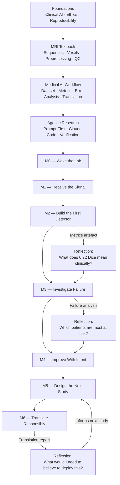

# Course Overview

---

## Philosophy

Three principles govern every design decision in this course.

**Clinical relevance drives everything.** The missions, the metrics, the failure analysis, and the translation assessment are all anchored to a single question: could this system safely and usefully change how a clinician manages a patient? This question is harder than it looks. A model with a Dice coefficient of 0.85 on a benchmark dataset can still be dangerous if it fails silently on edge cases that represent exactly the patients most at risk. By keeping the clinical endpoint visible throughout the course, we resist the temptation to optimise for leaderboard numbers at the expense of clinical utility.

**AI is a tool, not magic.** Large language models and neural segmentation architectures are engineering artefacts. They have known failure modes, training distribution assumptions, and performance envelopes. Part of your job as a researcher using these tools is to understand those limits well enough to communicate them honestly in any paper, protocol, or deployment recommendation you produce. This course will equip you with the vocabulary and the habits of mind to do that.

**The prompt is the protocol.** In experimental science, a well-written protocol allows another researcher to reproduce your work. In agentic research, a well-written prompt allows an AI agent to execute your intent — and allows you to inspect, reproduce, and criticise what was done. The prompts you write during this course are your primary scientific outputs. They should be as precise and as falsifiable as a methods section.

---

## Two Pillars of the Course

The curriculum rests on two parallel pillars that are developed simultaneously throughout the two days.

### Pillar One: Clinical AI Knowledge

Understanding clinical AI requires understanding three nested contexts: the biology, the imaging physics, and the regulatory environment.

The biology matters because the model learns what is in the data, not what you wish were there. A segmentation model trained on gadolinium-enhancing tumour core will not generalise to infiltrative tumour margin unless that margin appears in training labels — and those labels require a neuropathologist, not just a radiologist. Without understanding glioblastoma biology, you cannot evaluate whether a model's outputs are clinically meaningful.

The imaging physics matters because MRI sequences are not interchangeable photographs. T1-weighted images, T1 post-contrast, T2-weighted images, and FLAIR each suppress or emphasise different tissue properties. A model that uses all four sequences is not simply using "more data"; it is triangulating across different physical tissue properties to achieve a more reliable localisation. Understanding this changes how you interpret multi-modal model failures.

The regulatory environment matters because deploying an AI system in clinical practice is not a research act; it is a product decision. In most jurisdictions, clinical AI systems that influence diagnosis or treatment are regulated as medical devices. Understanding the TRIPOD+AI reporting standard, CE marking processes, and FDA 510(k) pathway — even at a high level — changes what questions you ask when you evaluate your own model at the end of Mission 6.

### Pillar Two: Agentic Coding Skills

The second pillar is the ability to direct an AI coding agent with sufficient precision to conduct reproducible computational research. This requires three capabilities.

**Prompt engineering** is the craft of writing instructions that are specific enough to be actionable, constrained enough to avoid unintended behaviour, and verifiable enough that you can confirm the agent did what you asked. The [Prompt Library](../prompt_library/overview.md) in this site contains templates for every major task in the course. Studying those templates — understanding why each word is there — is as important as using them.

**Directing Claude Code** is the applied skill of operating within the Claude Code environment: opening files, inspecting outputs, asking follow-up questions, redirecting when the agent misunderstands your intent, and requesting verification of any result you are not certain about. The [Claude Code Workflow](../agentic_research/claude_code_workflow.md) chapter covers this in detail.

**Verifying artefacts** is the critical habit of never accepting an AI-generated output without inspection. Every mission produces a specific artefact — a metrics table, a segmentation overlay, a written assessment — and every artefact must be read critically before it is used as input to the next step. The questions at the end of each tutorial chapter are designed to prime this habit.

---

## The Mission Arc: A Narrative

The seven missions tell a coherent research story. This is deliberate.

You begin in Mission 0 not doing any science at all — you are simply checking that your tools work. This mirrors the reproducibility pre-flight that every computational researcher should run before investing effort in a new environment. It also grounds you in the physical reality of the system before abstractions accumulate.

Mission 1 asks you to look at the data before modelling it. This is a habit that is widely preached and widely skipped in practice. Here it is mandatory. You will find artefacts, unusual voxel spacings, intensity distributions that do not match textbook descriptions, and possibly labelling inconsistencies. These observations will matter in Mission 3.

Missions 2 and 3 form a paired unit: build, then break. You build a baseline model in Mission 2 and evaluate it honestly. You then select the case where it failed most badly and ask why, systematically, in Mission 3. This is classical scientific method: observe, hypothesise, design.

Mission 4 closes the loop: you intervene based on your hypothesis and measure whether the intervention worked. The most important scientific output here is not your improved Dice score; it is the written prediction you make before re-running the model, and the honest assessment of whether the data supported that prediction.

Mission 5 steps back from implementation and asks: if this were real, how would you validate it? This mission draws on clinical study design, statistical thinking, and an honest accounting of what population the current training data represents.

Mission 6 returns the entire pipeline to the clinic and asks the hardest question: is this ready? In most cases, the honest answer will be no, not yet — and the scientific contribution of Mission 6 is to articulate precisely what would need to change before the answer became yes.

---

## Why This Course Differs from Typical ML Courses

Most machine learning courses evaluate students on prediction accuracy. The student with the best model wins. This incentivises a particular kind of thinking: maximise the metric, minimise everything else.

This course has no leaderboard. Success is not measured by Dice coefficient. Success is measured by the quality of your scientific judgment: the clarity of your failure hypothesis in Mission 3, the precision of your intervention rationale in Mission 4, the rigour of your study design in Mission 5, the honesty of your translation assessment in Mission 6.

A student who builds a mediocre model but produces an exemplary error analysis — identifying exactly why the model fails and what biological feature drives the failure — has done better science than a student who achieves high metrics by luck of hyperparameter selection and cannot explain what the model learned.

This is the standard we hold clinical AI researchers to in practice. It is the standard we hold you to here.

---

## Learning Flow

The diagram below shows how the components of the course feed into each other. Tutorial sections provide conceptual grounding; missions operationalise that grounding in practice; artefacts produced by the missions become the material for reflection; reflection informs the next tutorial reading.

!!! info "Reading this diagram"
    The tutorial sections (top row) should be read before the missions they feed into. The reflection loops are not bureaucratic checkboxes; they are where the science happens. The questions at the bottom are examples of the kind of thinking each reflection should produce.
