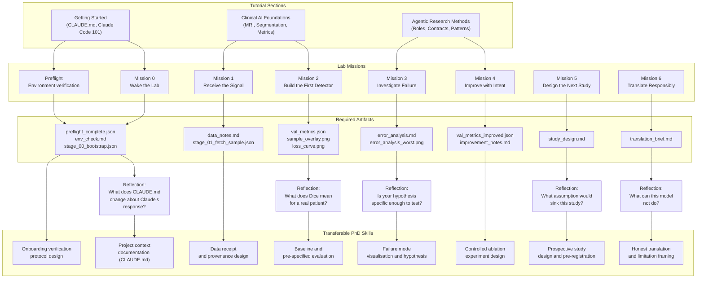

# Agentic Clinical AI Curriculum Map

This is the authoritative curriculum bridge connecting clinical AI concepts, Claude / agentic research methods, lab missions, and transferable PhD research skills. Use it to understand how each mission fits into the larger arc of the course, and to connect individual lab activities to the research competencies they are building.

---

## Course Philosophy

Clinical relevance drives everything in this course. Each lab mission is designed around a failure mode that actually occurs in deployed clinical AI systems — not a pedagogical simplification, but a real class of error with real patient consequences. The sequencing of missions mirrors the sequence of a clinical AI study: environment verification before data analysis, data inspection before modelling, baseline before improvement, error analysis before hypothesis formation, and honest translation before any claim of clinical applicability. A student who completes all seven missions has traversed, in miniature, the full arc of responsible clinical AI research.

The prompt is the experimental protocol. In agentic research, writing a prompt to Claude Code is equivalent to writing a methods section: it specifies what will be done, what will be measured, and what output will constitute a valid result. A vague prompt produces a result of unknown validity, just as a vague methods section produces an unreproducible experiment. This course trains students to write prompts that are specific enough to be reviewed, specific enough to be reproduced, and specific enough to be challenged — because those are the properties required of any scientific claim.

---

## Mission-by-Mission Mapping

| Mission | Traditional workflow pain point | Claude / agentic concept | Anthropic Academy alignment | Clinical AI concept | Prompt principle | Student action | Required artifact | Optional exploration | Transferable PhD research skill |
|---|---|---|---|---|---|---|---|---|---|
| **Preflight** | Environment setup assigned as homework; broken environments discovered mid-lab with misleading error messages | Claude as setup assistant; explicit checklist + output contract; honest failure reporting | Claude Code 101, Introduction to Claude Cowork | Reproducible environment as scientific prerequisite; environment configuration as experimental variable | Explicit checklist + exact output file + honest failure reporting; never trust what has not been verified | Run preflight prompt; review JSON and markdown report; remediate any `false` values before Mission 0 | `outputs/status/preflight_complete.json`, `reports/preflight_report.md` | Add disk space and GPU RAM checks to the preflight JSON (Layer C prompt) | Designing an onboarding verification protocol for a new collaborator joining your own research project |
| **Mission 0** | Hidden dependency conflicts; implicit assumptions about "ready"; environment chaos revealed at worst possible moment | CLAUDE.md as project memory; explicit output contract making readiness machine-checkable | Claude Code 101, Introduction to Claude Cowork, Claude Code in Action | Pipeline readiness verification before patient data analysis; project context as governance document | Explicit task + expected output + exact file paths; Claude reads context before acting | Read CLAUDE.md content, check packages, create output directories, write both output files; inspect both files for machine-specific content | `reports/env_check.md`, `outputs/status/stage_00_bootstrap.json` | Add hardware context: GPU availability, RAM, disk space (Layer C prompt) | Writing a CLAUDE.md for your own PhD project; identifying three domain-specific facts Claude needs to be useful |
| **Mission 1** | Students skip data inspection and discover corrupted labels or wrong class distributions during training, not before | Claude as data steward; inspect-before-model discipline; data receipt as governance document | Claude Code 101, Claude Code in Action, AI Fluency: Framework & Foundations | Data provenance verification; class imbalance detection; label alignment QA before modelling | Context before action — specify what to look for before asking Claude to look; inspector role, not developer role | Run data inspection prompt; read data receipt in full; document three findings before proceeding to Mission 2 | `reports/data_notes.md`, `data/sample/` directory, `outputs/status/stage_01_fetch_sample.json` | Visualise one MRI slice with label overlay; inspect for misalignment (Layer C prompt) | Designing a data receipt for your own PhD dataset; naming five properties that must be verified before analysis |
| **Mission 2** | Students begin with complex models; choose metrics post-hoc after seeing results; baselines become uninterpretable | Claude as planner then builder; plan-before-code pattern; evaluation contract specified before any code is written | Claude Code in Action, Claude Code 101, AI Capabilities and Limitations | Trustworthy baseline as scientific anchor; pre-specified evaluation metric prevents post-hoc metric selection | Plan-before-code: Claude proposes numbered steps and waits for approval; evaluation contract names metric, formula, expected range, output path, and schema before training | Review Claude's plan before approving; run Stage 02 (visualisation) then Stage 03 (training) separately; record Dice score as permanent reference | `outputs/metrics/val_metrics.json`, `outputs/figures/sample_overlay.png`, `outputs/figures/loss_curve.png`, `reports/train_notes.md` | One hyperparameter variation saved to separate file without overwriting baseline metrics (Layer C prompt) | Defining the simplest measurable baseline and pre-specified success criterion for a different medical AI task in your own research |
| **Mission 3** | Aggregate metric treated as complete evaluation; best and worst cases invisible; hypotheses generated without evidence | Claude as visual debugger then hypothesis generator; observation-before-hypothesis pattern enforced by prompt structure | AI Fluency for Students, AI Capabilities and Limitations, Claude Code in Action | Error map analysis; failure mode characterisation; qualitative-quantitative connection in model evaluation | Ask Claude to observe first, then explain — never hypothesis before evidence; two-phase prompt structure enforces separation | Phase 1: generate error maps, read them before reading Claude's description; Phase 2: hypothesis generation only after observation | `reports/error_analysis.md`, `outputs/figures/error_analysis_best.png`, `outputs/figures/error_analysis_worst.png` | Spatial failure analysis by slice position and lesion size (Layer C prompt) | Defining your equivalent of "worst-performing case" and the visualisation that would make the failure pattern visible in your own research model |
| **Mission 4** | Students change multiple variables between runs; cannot attribute improvements to specific causes; controlled experimentation habit absent | Claude as controlled experimenter; one-variable-at-a-time discipline; experimental log as research record | Claude Code in Action, AI Capabilities and Limitations, AI Fluency for Students | Controlled ablation study; improvement attribution in model development; difference between noise and genuine gain | Hypothesis-driven prompt: name the hypothesis, the single variable to change, the expected direction of change, and the output path before running any experiment | Implement one intervention from Mission 3 hypothesis; compare to baseline; document whether hypothesis was confirmed, partially confirmed, or refuted | `outputs/metrics/val_metrics_improved.json`, `reports/improvement_notes.md`, updated status JSON | Test a second hypothesis from Mission 3 if time permits; compare multiple interventions without confounding | Designing a single-variable improvement experiment for your own model, with pre-specified expected outcome and stopping criterion |
| **Mission 5** | Students conflate "this experiment worked" with "this is worth a study"; no discipline for transitioning from exploration to study design | Claude as study designer; distinction between exploratory analysis and a confirmatory study; pre-registration habits | Claude Code in Action, AI Fluency: Framework & Foundations, responsible AI modules | Prospective study design; sample size reasoning; external validity framing; honest limitation statement | Study design prompt: ask Claude to propose a study that would confirm or refute the Mission 4 finding; require Claude to name assumptions, required sample size, and failure criteria | Review Claude's proposed study design; identify the most important assumption; write one paragraph explaining why the Mission 4 result cannot be published without this study | `reports/study_design.md`, `outputs/status/stage_05_study_design.json` | Extend study design to include a power calculation or a simulation of expected outcomes (Layer C prompt) | Drafting the "next study" section of a research paper reporting your own most recent empirical finding |
| **Mission 6** | Students present AI performance claims without uncertainty quantification, limitation statements, or clinical context | Claude as clinical advisor constrained by honesty requirements; translation framing separates capability from deployment claim | Claude Code in Action, responsible AI modules, AI Capabilities and Limitations | Clinical translation framework; AI performance vs. clinical utility distinction; regulatory and ethical framing; uncertainty quantification | Honesty-constrained translation prompt: Claude must include confidence intervals, name at least two limitations, and explicitly state what the model cannot do — before describing what it can do | Review Claude's translation brief; identify the strongest claim and ask whether it can be defended from Mission 2–4 data alone | `reports/translation_brief.md`, `outputs/status/stage_06_translate.json` | Extend translation brief to include a failure mode disclosure section and a proposed monitoring plan (Layer C prompt) | Drafting the limitations and future work sections of your next research paper with specific, evidence-grounded constraints |

---

## Mermaid Diagram

---

## Learning Outcome Taxonomy

| Domain | Outcome | Mission where assessed |
|---|---|---|
| **Knowledge** | Describe the function of each MRI modality (T1, T1ce, T2, FLAIR) and why each contains different clinical information | Mission 1 data receipt — modality listing |
| **Knowledge** | Define the Dice coefficient, state its formula, and interpret a given Dice score in clinical terms | Mission 2 evaluation contract and train_notes.md |
| **Knowledge** | Distinguish between a false positive and false negative in tumour segmentation, including the asymmetric clinical consequences of each | Mission 3 error analysis report |
| **Knowledge** | Identify at least two regulatory or ethical requirements that must be satisfied before an AI tool can be used clinically | Mission 6 translation brief |
| **Skills** | Write a Claude Code prompt that specifies an output contract: exact file path, exact JSON schema, and honest failure reporting | Missions 0, 1, 2, 3 — assessed by whether artifacts match the specified schema |
| **Skills** | Assign Claude an explicit role (data steward, visual debugger, hypothesis generator, clinical advisor) and maintain role discipline within a session | Missions 1, 3, 4, 6 — assessed by whether Claude's output reflects the assigned role |
| **Skills** | Generate an error map, identify the dominant failure mode visually, and produce a specific testable hypothesis from that observation | Mission 3 — error_analysis.md hypothesis evaluation |
| **Skills** | Design a single-variable controlled experiment with a pre-specified expected outcome and stopping criterion | Mission 4 — assessed by whether improvement_notes.md documents one variable, one expectation, and one conclusion |
| **Attitudes** | Treat the prompt as an experimental protocol — revise it before running, not after seeing results | All missions — self-assessment in lab dashboard; instructor observation |
| **Attitudes** | Apply honest uncertainty quantification when translating AI performance to clinical applicability claims | Mission 6 — translation brief limitation statements |
| **Attitudes** | Inspect output files personally before treating Claude's completion message as confirmation that the task succeeded | All missions — assessed by whether students catch template outputs or placeholder values during inspection |
| **Attitudes** | Recognise that "the model improved" and "the model is ready for clinical use" are categorically different claims requiring different evidence standards | Mission 5 study design, Mission 6 translation brief |
